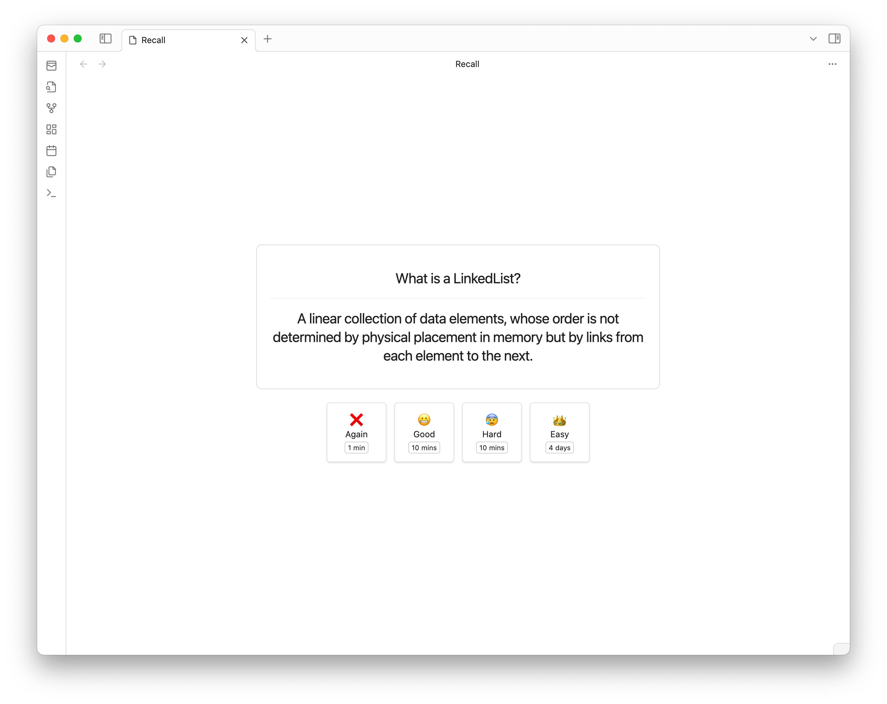

# Obsidian Better Recall


## What is it?

This plugin allows you to have an Anki-like feeling in Obsidian.
It allows you to create decks and add cards, giving you the ultimate spaced repetition experience.

The plugin integrates the following spaced-repetition algorithms:

- [Anki algorithm](https://faqs.ankiweb.net/what-spaced-repetition-algorithm.html)


## How to use it

Although everything with the plugin should be self-explanatory, here's a quick rundown of how to get started.

You can view your decks by clicking this sidebar icon:


You can also access your created decks by executing the command `Better Recall: Recall`.

With that, you can create decks and cards and start your spaced-repetition journey.

## Reviewing cards

By clicking on any deck you have created, you can start your spaced-repetition session (obviously you need cards in the deck).
Based on the specific parameters, the different timings and multiplier will be adjusted accordingly.



## Development

To customize this project for your needs, you can clone it and then install all dependencies:
```sh
$ git clone https://github.com/FlorianWoelki/obsidian-better-recall
$ cd obsidian-better-recall
$ yarn
```

After the installation, you need to create a `env.mjs` file in the root directory. Fill the file with the following content:

```js
export const obsidianExportPath =
  '<path-to-obsidian-vault>/.obsidian/plugins/obsidian-better-recall';
```

Afterward, you can start the rollup dev server by using:

```sh
$ pnpm dev
```

This command will automatically build the necessary files for testing and developing every change. Furthermore, it copies all the essential files to the specified plugin directory.

Finally, you can customize the plugin and add it to your plugins.
